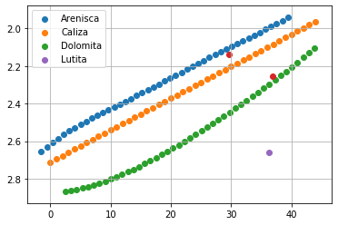

<h1 align="center">Interpretación automatizada de registros geofísicos de pozos</h1> 
_______________________________________________________________________________________________________________________________

<h5 align="center">Luis Terán</h5> 

La aplicación web completa se encuentra disponible en:

 
 https://registro-pozos-turae.herokuapp.com/

## Objetivo

El objetivo de este proyecto es obtener un método tal que la computadora sea capaz de realizar una interpretación de registros geofísicos de manera automática y sin intervención humana alguna dado un set de datos que contenga registros geofísicos.

## Desarrollo 

El procedimiento realizado por el programa es cómo se describe a continuación:

Lectura de datos
Al iniciar la ejecución del programa se solicitan diversos parámetros para elaborar la corrección e interpretación de los registros en cuestión, en caso de no ser ingresados se asignarán valores que no ejecutan ninguna corrección a los datos o bien, que permitan la ejecución del programa. Los parámetros solicitados son: 

- Archivo: Elección del archivo extensión LAS que contiene los registros geofísicos.
- FGR: Factor de corrección para el registro de Rayos gamma. Se recomienda usar las cartas de Schlumberger "Schlumberger - Log Interpretation charts", Sección 2-1, 2-2 y 2-3. El valor por defecto en caso de omisión es 1.
- FSP: Factor de corrección de para el registro de Potencial Espontáneo. Se recomienda usar las cartas de Schlumberger "Schlumberger - Log Interpretation charts", Sección 2-5, 2-6, 2-7, 2-8, 2-9, 2-10. El valor por defecto en caso de omisión es 1.
- FDEN: Factor de corrección para el registro de densidad. Se recomienda usar las cartas de Schlumberger "Schlumberger - Log Interpretation charts". El valor por defecto en caso de omisión es 0.
- FNPHI: Factor de corrección para el registro de Rayos gamma. Se recomienda usar las cartas de Schlumberger "Schlumberger - Log Interpretation charts". El valor por defecto en caso de omisión es 0.
- FRSOM: Factor de corrección para el registro de resistividad somera. Se recomienda usar las cartas de Schlumberger "Schlumberger - Log Interpretation charts", Sección 6-1,6-2,6-3,6-5,6-7. El valor por defecto en caso de omisión es 1.
- FRMED: Factor de corrección para el registro de resistividad media. Se recomienda usar las cartas de Schlumberger "Schlumberger - Log Interpretation charts", Sección 6-1,6-2,6-3,6-5,6-7. El valor por defecto en caso de omisión es 1.
- FRPROF: Factor de corrección de para el registro de resistividad profunda. Se recomienda usar las cartas de Schlumberger "Schlumberger - Log Interpretation charts", Sección 6-1,6-2,6-3,6-5,6-7. El valor por defecto en caso de omisión es 1.
- PMA: Densidad promedio de la matriz. El valor por defecto en caso de omisión es 2.45.
- PF: Densidad promedio de fluido. El valor por defecto en caso de omisión es 1.7.
- LMA, LFL: Lentitud promedio de la matriz y del fluido respectivamente.
- A: Factor de tortuosidad. El valor por defecto en caso de omisión es 1.
- M: Exponente de cementación. El valor por defecto en caso de omisión es 2.
- N: Exponente de saturación. El valor por defecto en caso de omisión es 2
- Método: Método para calcular el volumen de arcilla, El valor por defecto en caso de omisión es el método lineal.
- Nc: Número de litologías presentes, en caso de no describirse se determinará de forma automática.

## Identificación de curvas

Del archivo leído, dentro del cuadro descriptivo de este aspecto se extrae el nombre de las curvas, sus unidades respectivas y su descripción.
Posteriormente, se declara un diccionario que contiene posibles nombres, palabras clave o mnemónicos utilizados para describir el nombre de las curvas, así como las posibles unidades de las curvas y descripciones relacionadas con las curvas.
Para la identificación de las curvas se revisa por cada elemento en el diccionario la identificación de caracteres que se relacione con los nombres de las curvas extraídos de los archivos. 
La identificación se realiza con base en identificación de caracteres contenidos o bien, con el mnemónico de su clase. Por ejemplo:

Contenido del diccionario: “CAL”
Elementos que identificaría: “CALIPER”, “CALIP”, ”CAL” ,”CALI”, “RCALIPER”, “REGCALI”

En caso de no encontrar coincidencias por nombre, se repite el procedimiento anterior con las descripciones del archivo en comparación con las declaradas en el diccionario. Y en caso de no volver a encontrar coincidencias, se repite el proceso por tercera ocasión pero ahora con las unidades.

Porción del contenido del diccionario de búsqueda

## Revisión de datos disponibles y procedimiento a seguir

Una vez realizada la identificación de curvas, se realiza una revisión de que curvas se pudieron encontraron y cuales no pudieron ser identificadas, ya sea por falla del programa o porque no se encontraba el registro en el archivo LAS.
Con base en el registro de curvas identificadas se determina qué cálculos y gráficas se podrán realizar a lo largo del programa restante, así como los resultados que se entregarán.

## Corrección y cálculo de curvas
En la etapa de corrección de curvas, debido a la complicación que estas generaban, decidimos optar por la aplicación de correcciones de manera simplificada. Es decir, que el factor de corrección necesario sea obtenido de manera manual mediante aplicación de tablas para posteriormente aplicarse directamente a los registros del archivo

Posteriormente, el cálculo de las curvas de porosidad, saturación y volumen de arcilla se realizó de la siguiente manera:

Fórmula de temperatura de formación:

$ Tf = Ti = Ts + [(Tmax -Ts) / Dmax]*Di $

Fórmula de la múltiplicación del registros de resistividad por el factor de corrección:

$ Rmi = Rm[(Ts + C)/(Ti + C)] $
$ Rmfi = Rmf[(Ts + C)/(Ti + C)] $
$ Rmci = Rmc[(Ts + C)/(Ti + C)] $

Fórmula de resistividad de agua de fórmación:

$ Rweq = 10^(K*log(Rmfsq)+SP)/K; Rmfsq = Rmfe; K=61+0.133*Ti $

Fórmula para el cálculo del agua de formación:

$ Rw = \frac{Rweq + 0.131*10^{[1/log(BHT/19.99]-2.0}}{-0.5*Rweq+10^{[0.0426*log(BHT/50.8)]}} $

Fórmula para el índice de arcillosidad:

$ Igr = (GRlog - GRmin) / (GRmax - GRmin) $

Fórmula para el cálculo de volumen de arcilla de Clavier:

$ Vshale = 1.7*[3.38*(Igr+0.7)^{2}]^{0.5} $

Fórmula para el cálculo de volumen de arcilla de Steiber:

$ Vshale = Igr / (3.0 - 2.0*Igr) $

Fórmula para el cálculo de volumen de arcilla de Larionov:

$ Vshale = 0.083*(2^{3.7*Igr}-1) $

Fórmula para el cálculo de porosidad-densidad:

$ \Theta d = (\rho ma -\rho b)/(\rho ma -\rho fl) $

## Interpretación

Para realizar una interpretación, primero es necesario establecer las separaciones entre cada capa de la formación. Sin embargo, diferentes capas pueden pertenecer a una misma litología y repetirse a lo largo de la formación en diferentes intervalos. Para ello se hizo uso de las propiedades de los materiales de la siguiente manera:

Si utilizáramos dos propiedades de cada litología y las graficáramos en un plano bidimensional se verían de la siguiente manera:

Representación de dos propiedades en un registro

De la misma forma, debido a que las litologías comparten características similares que los describen, si utilizáramos una mayor cantidad de valores discretos como los incluidos en un archivo LAS, se verían de la siguiente manera:

Representación de dos propiedades en un registro

Y consecuentemente, si lográramos que el programa pudiera diferenciar los grupos y asignar cada punto a su respectiva profundidad podríamos establecer una clasificación de las litologías que existen.

Esto se realizó mediante algoritmos de Machine Learning de clasificación no supervisada utilizando dos enfoques diferentes:
- El primer enfoque (Algoritmo de K-means) parte de la idea de que se conoce el número de litologías presentes, y por lo tanto el número de agrupaciones de puntos, por lo que es necesario adaptar el modelo a la información establecida. Por esa misma razón, es posible obtener resultados más precisos.
- El segundo enfoque (Algoritmo de Mean Shift) toma la idea de que no se conoce el número de litologías presentes, por lo que automáticamente se determinará el número de agrupaciones, pero con menor precisión.
Previo a la aplicación de los algoritmos es necesario aplicar una normalización de los datos para fomentar la convergencia de los algoritmos. Esto es, que cada rango de variación de los registros sea de 0 – 1.

Agrupación de las propiedades contenidas en el registro

Asimismo, con las diferentes litologías que existen es natural que ciertas litologías compartan características con otra litología presente en la formación, produciendo un efecto de traslape.

Traslape de puntos respecto a dos propiedades en el registro

Sin embargo, podríamos tomar en cuenta otra propiedad (otro registro geofísico) determinante que diferencie una litología de la otra y graficarla. Esto generaría que se diferencien las litologías.

Representación gráfica de puntos del registro utilizando tres propiedades

En caso de volver a repetirse podríamos integrar nuevamente una propiedad más y diferenciar. Esto implicaría utilizar cuatro dimensiones lo que resulta complicado de interpretar visualmente para un ser humano, pero resulta factible para una computadora. Incluso se podrían manejar n cantidad de características para diferenciar litologías, por lo que se podría utilizar toda la información disponible para clasificar las litologías, y mientras mayor sea el número de características o registros que se tengan disponibles, será mayor la precisión para diferenciar. 

Ejemplo de separación de la formación por capas

Una vez realizado este proceso, es posible diferenciar cada una de las capas. No obstante, se desconoce aún a cuál litología pertenecen. Para determinar a qué litología pertenecen se reconstruyó el crossplot de densidad contra porosidad de neutrón.

Como paso inicial, se obtuvieron los valores promedio de las propiedades para cada agrupación obtenida, incluyendo aquellos que se repiten en intervalos separados. 

Para obtener el crossplot, manualmente se observaron aproximadamente doce puntos en la gráfica de cada una de las líneas y se realizó una interpolación polinomial de 5° grado. Una vez obtenidos los coeficientes de la curva, se remuestrearon las curvas con 45 puntos obteniendo la representación completa de las curvas.

Crossplot de densidad contra porosidad de neutrón

Posteriormente, los valores promedio de densidad y porosidad de neutrón de cada agrupación son colocados en el crossplot. Para identificar a qué curva pertenecen, se calcula la distancia euclidiana con cada uno de los puntos de muestreo de las curvas y se elige aquel que tiene una menor distancia al punto. Y así, se obtiene la información de a qué litología pertenece.

Discretización de las curvas del crossplot

Finalmente, la información obtenida es expuesta en un gráfico final. Antes de realizar dicho gráfico, debido a que el contenido del gráfico puede variar dependiendo si se cuenta con ciertos registros o no, primero se hace un conteo de gráficos a realizar y consecutivamente se van desplegando las imágenes respectivas en función de los registros o cálculos que se pudieron realizar.

## Herramientas utilizadas

Para el despliegue total del programa se utilizaron diferentes herramientas de trabajo, las cuales son descritas a continuación:

- Python: El procesamiento completo de los datos fue desarrollado en el lenguaje de programación Python, a este proceso interno se le conoce como “Back-end”. Las versiones de prueba y verificación del código fueron desarrolladas en Jupyter Notebook. Se utilizaron diversas bibliotecas que contribuyeron al procesamiento completo del programa, las cuales son:
       -Las: Es una librería encargada de la lectura de archivos .LAS, donde se divide la información en función de los diferentes segmentos que contiene el archivo, lo que facilita el acceso a datos específicos.
       -Pandas: Es una librería para el manejo y operación de datos (similar a Excel), esta librería permitió establecer los datos dentro de un marco organizado. Además permitió realizar los cálculos de manera rápida, sencilla y entendible para la lectura del código.
       -Numpy: Una librería matemática que permite agilizar el manejo de datos, así como realizar operaciones matemáticas tales como interpolaciones, manejo de matrices, ordenamiento de valores, etc.
       -Matplotlib: Es una librería que permite al usuario graficar con un alto grado de libertad.
       -Scikit-learn: Librería de Machine Learning para Python
- Flask: Es un framework de desarrollo para aplicaciones web y de escritorio. Esta herramienta permite conectar el proceso interno con la interfaz gráfica de usuario, es decir, el back-end con el front-end. Para el desarrollo del front-end o interfaz gráfica, se utilizó HTML y CSS dentro del marco referenciado por Flask, que a su vez conecta con el programa en Python. El framework permite el proceso de transferencia de lectura y recepción  de datos de un lenguaje a otro. Al mismo tiempo, este framework permite establecer la conexión con el formato de despliegue.
- Heroku: Es un servidor de despliegue de aplicaciones web gratuito. Permite utilizar el formato creado con Flask y generar un servidor de Python con los elementos necesarios instalados para que sea posible procesar los datos.

## Resultados

Para mostrar el funcionamiento del programa se usó como referencia el archivo “registros.las” otorgado por el profesor Jose Luis Ortiz el semestre pasado en la clase de “Registros Geofísicos de pozos”. El resultado obtenido para ese archivo fue el siguiente:

Ejemplo del resultado arrojado por el programa

Se optó por utilizar este archivo debido a que la interpretación de este archivo fue utilizado como forma de evaluación del segundo parcial. Posteriormente fueron verificadas las respuestas en clase, por lo que se cuenta con la respuesta correcta de la interpretación de los registros. 

Resultados verdaderos del archivo utilizado

Utilizando como criterio conocido que existen 3 litologías en la formación, el resultado obtenido por medio del programa fue el siguiente:

Resultado arrojado por el programa para una formación de tres litologías

Por otro lado, utilizando la clasificación automática se obtiene el siguiente resultado:

Resultado arrojado por el programa para una clasificación automática

Como se puede observar los resultados obtenidos tanto para la clasificación automática como para la clasificación con número de litologías asignado es muy similar a los resultados verdaderos. Y los límites entre litologías están casi definidos de manera precisa. Si bien esto es debido a que los datos utilizados son datos educativos y por lo tanto bien definidos, también significa que el método es factible a identificar litologías. 

Otro aspecto importante, es que el programa falla en identificar a la lutita. Esto es debido a que únicamente toma dos registros (densidad y porosidad de neutrón) para determinar a qué litología pertenece, y de acuerdo al gráfico realizado estos dos parámetros en ese intervalo coinciden con los de la curva de la dolomita, tanto los de interpretación automática como los de litologías identificadas.

Crossplot del resultado del programa para tres litologías

Crossplot del resultado del programapa para clasificación automática

Resultado arrojado por el programa para una formación de cinco litologías

## Conclusiones

El programa permite hacer la lectura, organización, corrección y cálculos en los datos de manera efectiva. Dentro del procedimiento realizado, se puede destacar lo siguiente:

El programa puede identificar curvas ya sea por nombre, unidades o descripción. Sin embargo, puede haber ciertas curvas que no hayan sido contempladas en el diccionario de identificación. Todas aquellas que no sean identificadas podrían agregarse posteriormente fácilmente al diccionario.

La corrección aún requiere en gran parte de cálculos y procedimientos realizados a mano, ya que resulta muy complejo programar todo el proceso de corrección se simplificó este al máximo de manera que únicamente se aplicaran factores de corrección y solo se ejecutaran aquellos cálculos con fórmula.

La interpretación ofrece resultados razonables. Estamos conscientes de que la interpretación realizada por el programa no es exacta, pero consideramos que una interpretación precisa va más allá de los alcances de este proyecto.

